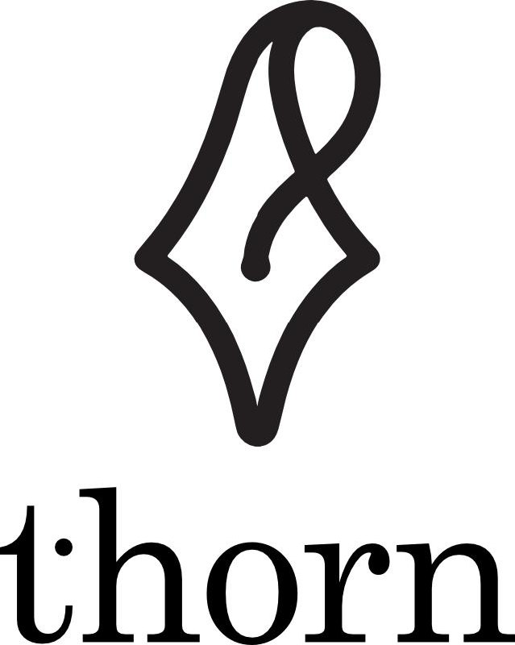
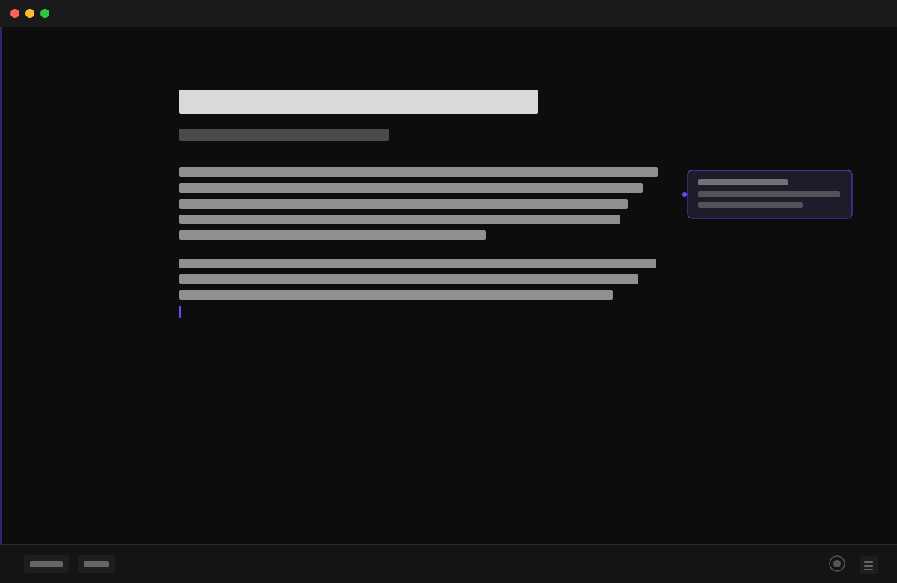
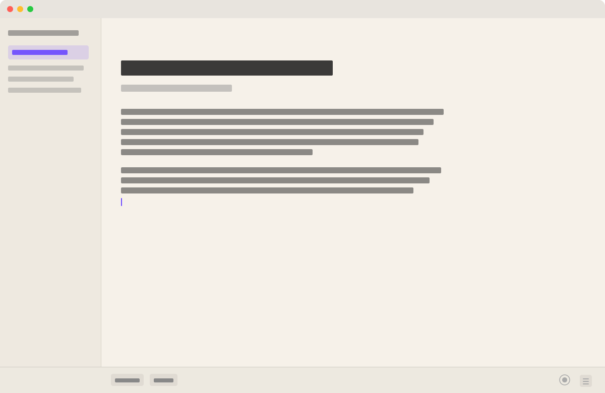

<div align="center">
  
  <br/><br/>
  <strong>A distraction-free writing app that lives in a single HTML file.</strong>
  <br/>
  No install. No account. No cloud.
  <br/><br/>
  <a href="https://thorn.ink">thorn.ink</a> &nbsp;·&nbsp;
  <a href="https://thorn.ink#download">Download</a> &nbsp;·&nbsp;
  <a href="https://x.com/christianegli">@christianegli</a> &nbsp;·&nbsp;
  MIT License
</div>

<br/>



---

## The idea

Most writing apps are either too simple or buried under features. thorn is the one I always wanted — minimal by default, powerful when you need it.

A single `.html` file. Open it in any browser and start writing. Your documents live in `localStorage`. Nothing goes anywhere unless you tell it to.

---

## Get it

**Simplest path:**

```
1. Download thorn.html
2. Open it in your browser
3. Write
```

[**→ Download thorn.html**](https://raw.githubusercontent.com/christianegli/thorn/main/thorn.html)

Or open it directly at [thorn.ink](https://thorn.ink).

**Add to Dock (macOS Safari):** File → Add to Dock. Now it behaves like a native app.

**Native macOS app** — signed and notarized. [Watch the repo](https://github.com/christianegli/thorn) for the release.

---

## Light mode



---

## Features

**Writing**
- Markdown with live formatting
- Multiple documents, all local
- Adjustable font size and line width
- Fullscreen / focus mode

**Themes**
- Light, Dark, Sepia, Paper, Midnight, Forest
- Toggled from the status bar — one click

**Keyboard**

| Key | Action |
|---|---|
| `⌘K` | Command palette |
| `⌘,` | Settings |
| `⌘S` | Commit to GitHub |
| `⌘E` | Annotate selected text |
| `⌘J` | AI sidebar |
| `⌘P` | Print / export PDF |
| `⌘O` | Open a local `.md` file |

**GitHub sync**

Connect a personal access token, repo name, and file path once in Settings. `⌘S` commits the current document as plain Markdown. Your words, your repo, always.

**AI sidebar**

Works with any OpenAI-compatible endpoint.

| Provider | Endpoint |
|---|---|
| OpenAI | `api.openai.com/v1/chat/completions` |
| Groq | `api.groq.com/openai/v1/chat/completions` |
| Ollama (local) | `localhost:11434/v1/chat/completions` |
| OpenRouter | `openrouter.ai/api/v1/chat/completions` |

Your API key stays in `localStorage`. Nothing leaves your device except the request you trigger.

**Annotations**

Hover the right edge of any paragraph to attach a private note. Useful for editorial feedback, research links, version comments.

**PDF export**

Five literary print styles. Works offline, no server needed.

---

## Self-hosting / development

```bash
# Serve locally (for PWA features)
npx serve .

# Or just open the file
open thorn.html
```

The service worker (`sw.js`) enables full offline use when served over HTTPS. The PWA manifest (`manifest.json`) allows installation via browser.

---

## Architecture

Everything is one file: `thorn.html`. No build step, no npm, no bundler. If you want to fork or extend it:

- All styles are in `<style>` at the top
- All logic is in `<script>` at the bottom
- `localStorage` keys are prefixed `thorn_`
- AI config: `aiEndpoint`, `aiKey`, `aiModel`, `aiPrompt`
- GitHub config: `ghToken`, `ghRepo`, `ghPath`, `ghBranch`

---

## License

MIT. Fork it, ship your own version, do what you want.
