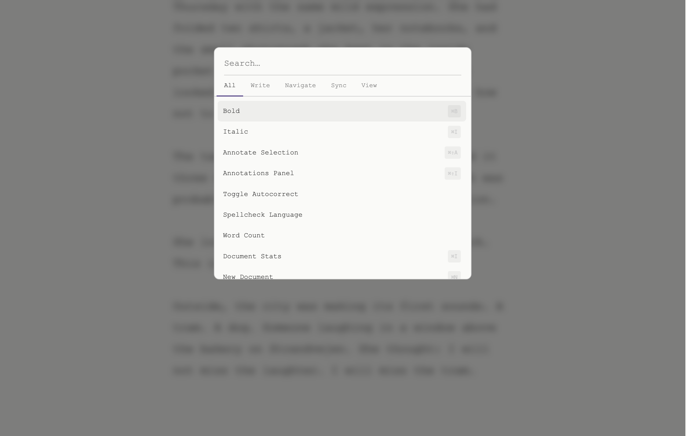
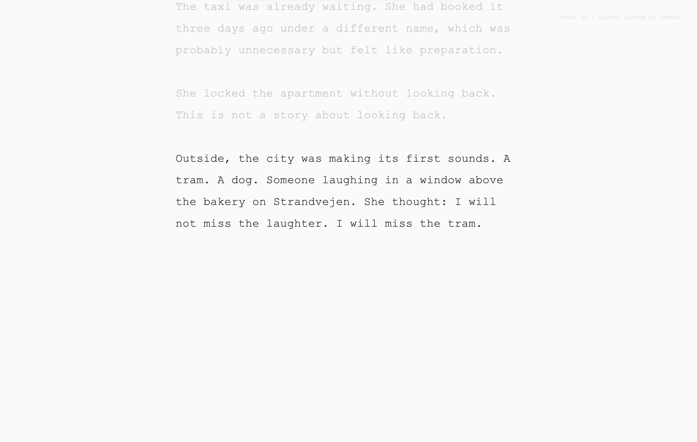

<div align="center">
  
  <br/><br/>
  <strong>A distraction-free writing app that lives in a single HTML file.</strong>
  <br/>
  No install. No account. No cloud.
  <br/><br/>
  <a href="https://thorn.ink">thorn.ink</a> &nbsp;·&nbsp;
  <a href="https://thorn.ink/guide.html">Manual</a> &nbsp;·&nbsp;
  created by <a href="https://x.com/christianegli">@christianegli</a> &nbsp;·&nbsp;
  CC BY-NC 4.0
</div>

<br/>


---

## The idea

Most writing apps are either too simple or buried under features you didn't ask for. thorn is the one I always wanted — minimal by default, powerful when you need it.

A single `.html` file. Open it in any browser and write. Your documents live in `localStorage`. Nothing goes anywhere unless you tell it to.

---

## Get it

**Simplest:**

```
1. Download thorn.html
2. Open in your browser
3. Write
```

[**→ Download thorn.html**](https://raw.githubusercontent.com/christianegli/thorn/main/thorn.html)

Or use it at [thorn.ink](https://thorn.ink) — no install required.

**Add to Dock (macOS Safari):** File → Add to Dock. Behaves like a native app.

---

## Features

**Writing**
- Markdown with live formatting
- Multiple documents, all local
- Adjustable font size and line width
- Focus mode — dims everything except the active paragraph

**Themes**
Eight built-in: Light, Dark, Sepia, Paper, Midnight, Forest, Warm, Typewriter. One click in the status bar.

**Command palette**



`⌘K` opens everything. Search commands, navigate documents, switch themes — keyboard-first.

**GitHub sync**

Connect a personal access token, repo, and file path once in Settings. `⌘S` commits the current document as plain Markdown. Your words, your repo.

**Focus mode**



Dims all paragraphs except the one you're writing. Toggle with `⌘⇧F`.

**AI annotations**

Works with any OpenAI-compatible endpoint — OpenAI, Groq, Ollama, OpenRouter. Your API key stays in `localStorage`.

**Annotations**

Hover the right edge of any paragraph to attach a private note — editorial feedback, links, version comments.

**PDF export**

Five literary print styles. Offline, no server.

---

## Keyboard shortcuts

| Key | Action |
|---|---|
| `⌘K` | Command palette |
| `⌘,` | Settings |
| `⌘S` | Commit to GitHub |
| `⌘⇧F` | Focus mode |
| `⌘⇧A` | Annotate selection |
| `⌘J` | AI sidebar |
| `⌘P` | Print / export PDF |
| `⌘O` | Open local `.md` file |

Full reference: [thorn.ink/guide.html](https://thorn.ink/guide.html)

---

## Self-hosting

```bash
# Serve locally
npx serve .

# Or just open the file directly
open thorn.html
```

The service worker (`sw.js`) enables full offline use over HTTPS. The manifest (`manifest.json`) enables browser installation.

---

## Architecture

Everything is one file: `thorn.html`. No build step, no npm, no bundler.

- All styles in `<style>` at the top
- All logic in `<script>` at the bottom
- `localStorage` keys prefixed `prose_`
- GitHub config: `ghToken`, `ghRepo`, `ghPath`, `ghBranch`
- AI config: `aiEndpoint`, `aiKey`, `aiModel`, `aiPrompt`

---

## License

[CC BY-NC 4.0](LICENSE) — free for personal use. Fork it. Write in it.
